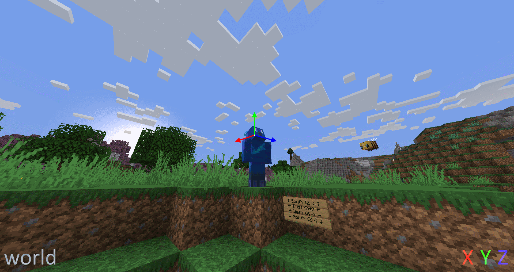

# Space

A space is a [String](../../types/data_types/string.md) which defines which coordinate system is used for directions, currently only used in [Add Velocity (Entity Action Type)](../../types/entity_action_types/add_velocity.md).

* `world`: The axes are global: `x` goes from west (negative) to east (positive), `y` from bottom to top, and `z` from north to south.
* `local`: The axes are local to the entity: `x` goes towards its left side and is always horizontal, `y` is pointing towards the top of the entity's head, and `z` points in the direction the entity is looking.
* `local_horizontal`: Same as `local` except it considers the vertical length of the direction the entity is looking to be 0. Thus `z` is projected (flattened out) onto the horizontal plane, making it shorter. `x` and `y` also become shorter by the same amount, and `y` is always pointing up. The axes shrink as the direction the entity is looking diverges from being horizontal, so, if the entity is looking straight up or straight down, the axes will have a length of 0, akin to forcing `x`, `y`, and `z` to be 0.
* `local_horizontal_normalized`: Same as `local_horizontal` but the axes are normalized (brought back to their previous length of 1) if they're of non-zero length.
* `velocity`: The axes are local to the entity's velocity in a way similar to `local`. If the velocity is purely vertical, the way the entity is pointing is used to determine the direction of `x` and `y` instead of the velocity. The axes scale based on how fast the entity is moving, so if it's immobile, the axes will have a length of 0, akin to forcing `x`, `y`, and `z` to be 0.
* `velocity_normalized`: Same as `velocity`, however the axes are normalized, and thus don't depend on the speed of the entity as long as it's moving.
* `velocity_horizontal`: Same as `velocity`, however the upwards velocity is considered to be 0.
* `velocity_horizontal_normalized`: Same as `velocity_horizontal`, however the axes are normalized.

